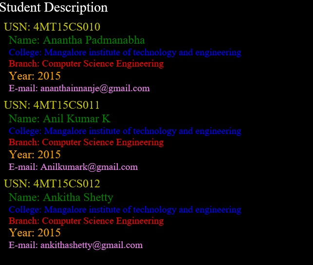

# VTU-Web-lab-program-5
### XML document to store information about a student in an engineering college affiliated to VTU. The information must include USN, Name, and Name of the College, Branch, Year of Joining, and email id. Make up sample data for 3 students. Create a CSS style sheet and use it to display the document.
## Screenshot

